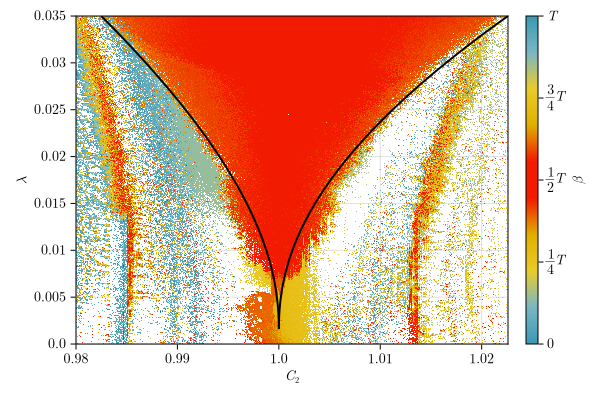

# Computational analysis in neuroscience

This repository holds sources and materials for Master's thesis named 'Computational analysis in neuroscience' by Štěpán Zapadlo under the supervision of doc. RNDr. Lenka Přibylová, Ph.D., at the Department of Mathematics and Statistic, Faculty of Science, Masaryk University, Brno.

::include{file=partials/abstract.qmd}



> [!important]
> Note that tag *"v1.0 (submission)"* marks the state of the thesis (and the entire repository) as of submission on 05.05.2025. Any succeeding git commits constitute a form of errata and should be treated as such regarding the official thesis examination.

## Structure

This repository contains following folders:

- `sections`: Quarto source files for the actual thesis
- `partials`: Bilingual parts of the thesis (abstract, acknowledgments, declaration)
- `mathematics`: LaTeX/MathJax macros used throughout the thesis, see also [this repository](https://gitlab.com/sceptri/md-math)
- `lua_filters`: Lua Filters for Pandoc (on top of which is Quarto built) fine-tuning the rendering process for both HTML and PDF targets
- `diagrams`: Draw.io diagrams
- `scripts`: Computation and rendering scripts
  - `delay_*` and `no_delay_*`: Numerical experiments used in the 2nd chapter (results of which are saved into `data/` and rendered by code included in the Quarto files themselves)
  - `delay_computation_metacentrum.jl` and `no_delay_computation_metacentrum.jl`: Numerical experiments to be ran on [MetaCentrum](https://metavo.metacentrum.cz/en/), see also `jobs/`
  - other files are used for rendering results in the Quarto documents, where they are included in the corresponding Julia code
- `jobs`: Batch job definitions for MetaCentrum scheduler
- `data`: Outputs of numerical experiments
- `src`: Julia source code to be used in multiple numerical experiments (outside of packages) - contains only the coupled interneurons model definition
- `_extensions/munithesis`: Extension to combine LaTeX thesis template from DMS, SCI MUNI, with capabilities of Quarto, see also [respective git repository (WIP)](https://gitlab.com/sceptri-university/muni-thesis)
- `presentation`: Presentation and other materials related to the defense of the thesis

Also:
- `julia_env`: Necessary Julia packages required to start the Quarto Julia engine, i.e., QuartoNotebookRunner.jl
- `assets`: Various other files necessary at some point (logos, assignment, etc.)
- `_freeze`: Contains cached results of computations
- `_book`: Rendered project, rendered PDF and HTML can be found here

Throughout the thesis, several custom-made packages are used:
- [**NeuronToolbox.jl**](https://gitlab.com/sceptri-university/gamu/neuron-toolbox) - Julia package providing various neurological models and methods of organizing them into networks
- [**GridWalker.jl**](https://gitlab.com/sceptri-university/gamu/gridwalker.jl) - Julia package to perform grid-based computation of shift for systems of 2 (weakly) coupled oscillators; it comes with handful of tips for staying on the correct manifold etc.

## Running

First, we advise to initialize a corresponding Julia environments:

- `julia --project="./julia_env" -e 'using Pkg; Pkg.instantiate()'` (for Quarto)
- `julia --project="./sections" -e 'using Pkg; Pkg.instantiate()'` (for the actual computations)

Afterward, it is simply a matter of running
```bash
quarto render --to all
```

Note that the render process may take some time (approx. 5-10 minutes).

> If you are running NixOS, all necessary packages should be bundled in the `shell.nix`.

## Acknowledgments

::include{file=partials/acknowledgement.qmd}